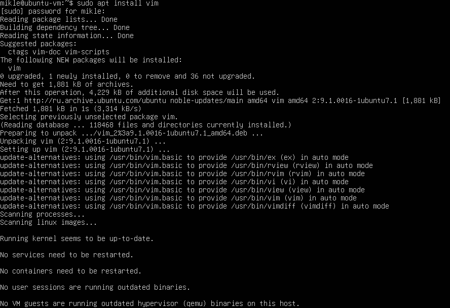

# Linux_D01:

----------------------------------------------------------------------------

- [Linux\_D01:](#linux_d01)
  - [1. Установка ОС:](#1-установка-ос)
  - [2. Создание пользователя:](#2-создание-пользователя)
  - [3. Настройка сети ОС:](#3-настройка-сети-ос)
  - [4. Обновление ОС:](#4-обновление-ос)
  - [5. Использование команды sudo:](#5-использование-команды-sudo)
  - [6. Установка и настройка службы времени:](#6-установка-и-настройка-службы-времени)
  - [7. Установка и использование текстовых редакторов:](#7-установка-и-использование-текстовых-редакторов)
  - [8. Установка и базовая настройка сервиса SSHD:](#8-установка-и-базовая-настройка-сервиса-sshd)
  - [9. Установка и использование утилит top, htop:](#9-установка-и-использование-утилит-top-htop)
  - [10. Использование утилиты fdisk:](#10-использование-утилиты-fdisk)
  - [11. Использование утилиты df:](#11-использование-утилиты-df)
  - [12. Использование утилиты du:](#12-использование-утилиты-du)
  - [13. Установка и использование утилиты ncdu:](#13-установка-и-использование-утилиты-ncdu)
  - [14. Работа с системными журналами:](#14-работа-с-системными-журналами)
  - [15. Использование планировщика заданий CRON:](#15-использование-планировщика-заданий-cron)

----------------------------------------------------------------------------

## 1. Установка ОС:
- Скачал с официального сайта [Virtual box](https://www.virtualbox.org/wiki/Downloads)

> Версии Virtual box для разных ОС
> 
> 
> 

- Установил Virtual box на компьютер.
- Скачал ISO-образ [Ubuntu 20.04 Server LTS](https://ubuntu.com/download/server)
- Открыл установленный Virtual box.
- Нажал кнопку "Создать" для создания новой виртуальной машины.

> Интерфейс Virtual box
>
> 
> 

- Указал имя ОС ВМ "Ubuntu Server 20.04", и путь до скаченного ISO-образа. Нажал "Далее".
- Указал Имя пользователя, пароль, имя хоста и доменное имя. Нажал "Далее".
- Основную память выделил на 2048мб, и 1 виртуальный процессор. Нажал "Далее".
- Создал виртуальный жесткий диск на 10гб.
- После загрузки виртуальной машины выбрал язык установки и нажал "Enter".

> Начало установки Ubuntu 20.04
>
> 
>

- Следовал инструкциям установщика:
  - выбрал раскладку клавиатуры.
  - выбрал обычную установку Ubuntu server.
  - выбрал конфигурацию сети, для обновления сервера, а именно: internet controller хостовой машины.
  - настройку прокси не использовал.
  - зеркало архивов Ubuntu оставил по умолчанию.
  - в конфигурации хранилища выбрал созданный виртуальный диск на 10гб и автоматическую разметку.
  - в конфигурации профиля указал имя пользователя, имя сервера и пароль.
  - пропустил update ubuntu pro.
  - в конфигурации SSH оставил "разрешить аутентификацию по паролю через SSH".
  - пропустил установку дополнительных утилит.
  - дождался окончания установки и перезапустил систему.
  - после перезапуска ввел логин и пароль своего пользователя.
  - выполнив команду `cat /etc/issue` узнал версию Ubuntu.

> Версия Ubuntu
>
> 
>

----------------------------------------------------------------------------

## 2. Создание пользователя:
- Выполнил команду от имени администратора `sudo` `adduser [имя нового пользователя]`.
- Подтвердил действие паролем администратора.
- Ввел пароль для нового пользователя.

> Создание нового пользователя Ubuntu
>
> 
> 

- Остальную информацию о пользователе пропустил нажатием на "Enter".
- После создания пользователя, добавил его в группу adm с помощью команды `sudo usermod -aG adm (имя пользователя)`
- После проверил, что новый пользователь добавлен в группу adm, используя команду `groups (имя пользователя)`

> Проверка группы пользователя
>
> 
> 

- Ввел команду `cat /etc/passwd`

> Вывод файла /etc/passwd
>
> 
>

----------------------------------------------------------------------------

## 3. Настройка сети ОС:
**Смена имени сервера:**
- Выполнил команду `hostname`, что бы узнать текущее имя сервера.

> Текущее имя сервера
>
> 
>

- Выполнил команду от имени администратора `sudo` `hostname [новое название машины]`.
- Подтвердил действие паролем администратора.
- Проверил текущее имя сервера командой `hostname`.

> Изменение имени сервера
>
> 
>

**Смена значения часового пояса и времени:**
- Выполнил команду `ls -lh /etc/localtime`, что бы узнать текущее значение часового пояса и времени.

> Текущее значение часового пояса и времени
>
> 
>

- Выполнил команду от имени администратора `sudo` `timedatectl set-timezone Europe/Moscow`.
- Подтвердил действие паролем администратора.
- Проверил текущее значение часового пояса и времени командой `ls -lh /etc/localtime`.

> Изменение часового пояса и времени
>
> 
>

**Вывод названий сетевых интерфейсов с помощью консольной команды:**
- Выполнил команду `ls /sys/class/net`.

> Перечень сетевых интерфейсов в директории /sys/class/net
>
> 
>

*lo (loopback device) – виртуальный интерфейс, присутствующий по умолчанию в любом Linux. Он используется для отладки сетевых программ и запуска серверных приложений на локальной машине. С этим интерфейсом всегда связан адрес 127.0.0.1. У него есть dns-имя – localhost. Посмотреть привязку можно в файле /etc/hosts.*

> Вывод файла /etc/hosts
>
> 
>

**Получение ip адреса устройства, от DHCP сервера, с помощью консольной команды:**
- Выполнил команду от имени администратора `sudo` `apt install net-tools`, что бы установить пакет net-tools.

*Пакет net-tools включает в себя утилиты для управления сетевыми настройками, такие как ifconfig, netstat, arp, и другие полезные инструменты для администрирования сети.*

- Подтвердил действие паролем администратора.

> Установка net-tools
>
> 
>

- Выполнил команду `ifconfig`, что бы узнать ip адреса устройства, от DHCP сервера.

> Список сетевых интерфейсов и информацию о них
>
> 
>

***DHCP** — (Dynamic Host Configuration Protocol) - протокол динамической конфигурации хоста. Сетевой протокол, позволяющий устройствам автоматически получать IP-адрес и другие параметры, необходимые для работы в сети TCP/IP. Данный протокол работает по модели «клиент-сервер». Для автоматической конфигурации компьютер-клиент на этапе конфигурации сетевого устройства обращается к так называемому серверу DHCP и получает от него нужные параметры. IP-адрес (Internet Protocol) - способ адресации устройств по сети.*

**Определение и вывод на экран внешнего ip-адреса шлюза (ip) и внутреннего IP-адреса шлюза (gw):**

- Выполнил команду, `ip route` `| grep default`, используя утилиту grep, что бы отсортировать поиск по слову *default*.

> Внешний ip-адрес шлюза: 10.0.2.2
>
> 
>

- Выполнил команду `ip addr`.

> Внутренний ip-адрес шлюза: 10.0.2.15 (с маской подсети 24)
>
> 
>

**Установка статичных (заданных вручную, а не полученных от DHCP сервера) настроек ip, gw, dns:**

*Начиная с релиза Ubuntu 17.10, для управления конфигурацией сети используется утилита Netplan.*
- Выполнил команду, `ls /etc/netplan`, что бы проверить наличие файла конфигурации Netplan.

> Директория /etc/netplan
>
> 
>

- Выполнил команду от имени администратора `sudo` `vim /etc/netplan/50-cloud-init.yaml`, что бы открыть файл конфигурации сети.

> Файл конфигурации netplan
>
> 
>

- Отредактировал конфигурационный файл, задав статичные настройки ip, gw, публичный DNS.

> Отредактированный файл конфигурации netplan
>
> 
>

```yaml
network:
  version: 2
  ethernets:
    enp0s3:
      dhcp4: false # Отключение DHCP для данного интерфейса (статическая настройка IP).
      addresses: [10.0.2.78/24] # Статический IP-адрес для интерфейса enp0s3 с маской сети /24 (255.255.255.0).
      routes: # Настройка маршрута по умолчанию (default route).
        - to: default 
          via: 10.0.2.2 # IP-адрес шлюза, через который будет осуществляться доступ к другим сетям (включая интернет).
      nameservers: # Настройки DNS-серверов.
        addresses: [1.1.1.1, 8.8.8.8] # Список IP-адресов DNS-серверов для разрешения доменных имен.
```

- Выполнил команду от имени администратора `sudo` `netplan try`, что бы проверить корректность конфигурации перед применением.
- Выполнил команду от имени администратора `sudo` `netplan apply`, что бы применить настройки.
- Выполнил команду от имени администратора `sudo` `reboot`, для перезапуска машины.

> Применения настроек конфигураций Netplan
>
> 
>

- После перезапуска машины проверил изменение внутреннего ip-адреса шлюза командой `ip addr`.

> Внутренний ip-адрес шлюза: 10.0.2.78 (с маской подсети 24), который я указал в файле конфигурации
>
> 
>

- Выполнил команду, `ip route` `| grep default`.

> Внешний ip-адрес шлюза, остался тот же: 10.0.2.2, который я указал в файле конфигурации
>
> 
>

- Выполнил команду, `ping 1.1.1.1`.

> Успешно пропингованный удаленный хост 1.1.1.1
>
> 
>

- Выполнил команду, `ping 8.8.8.8`.

> Успешно пропингованный удаленный хост 8.8.8.8
>
> 
>

- Выполнил команду, `ping ya.ru`.

> Успешно пропингованный удаленный хост ya.ru
>
> 
>

----------------------------------------------------------------------------

## 4. Обновление ОС:
- Выполнил команду `cat /etc/lsb-release`, что бы узнать текущую версию ОС.

> Вывод файла /etc/lsb-release
>
> 
>

- Выполнил команду от имени администратора `sudo` `apt-get update`, для обновления сетевых пакетов.
- Выполнил команду от имени администратора `sudo` `apt upgrade`, для обновления ОС.
- Повторно ввел `sudo` `apt upgrade`, для проверки, что обновления отсутствуют.

> Обновление сетевых пакетов Ubuntu
>
> 
>

----------------------------------------------------------------------------

## 5. Использование команды sudo:

*В любой **Linux**-системе обязательно есть один привилегированный пользователь — `root`. Этот пользователь имеет права на выполнение любых действий, удаление любых файлов и изменение любых параметров. Как-то ограничить свободу действий `root` практически невозможно. С другой стороны, все остальные пользователи системы обычно не имеют большинства необходимых прав, например, прав на установку программ, поскольку это является административной операцией, права на которую есть только у `root`. Ещё одной распространённой операцией, доступной только суперпользователю, является копирование и изменение файлов в системных папках, куда обычный пользователь доступа не имеет*

*Раньше данная проблема решалась достаточно просто: при обладании паролем `root` можно было зайти в систему под его аккаунтом либо временно получить его права, используя команду `su`. Потом выполнить все необходимые операции и вернуться под обычного пользователя. В принципе, такая схема работает неплохо, однако у неё есть много существенных недостатков, в частности, невозможно никак (точнее, очень сложно) ограничивать административные привилегии только определённым кругом задач.*

*Поэтому в современных дистрибутивах **Linux** вместо root аккаунта для администрирования используется утилита `sudo`.*

*`sudo` — это утилита, предоставляющая привилегии root для выполнения административных операций в соответствии со своими настройками. Она позволяет легко контролировать доступ к важным приложениям в системе. По умолчанию, при установке **Ubuntu** первому пользователю (тому, который создаётся во время установки) предоставляются полные права на использование `sudo`. Т.е. фактически первый пользователь обладает той же свободой действий, что и `root`.*

*`sudo` используется всегда, когда вы запускаете что-то из меню Администрирования системы.*

**Разрешение пользователю, созданному в Part 2, выполнять команду sudo:**
- Выполнил команду от имени администратора `sudo` `adduser [имя пользователя] sudo`, что бы добавить пользователя в группу *sudo*.
- Подтвердил действие паролем администратора.

> Добавление пользователя в группу sudo
>
> 
>

**Изменение hostname ОС от имени пользователя, созданного в пункте Part 2 (используя sudo):**
- Переключился на другого пользователя с помощью команды `su [имя пользователя]`.
- Проверил текущее hostname ОС с помощью команды `hostname`.
- Выполнил команду от имени администратора `sudo` `hostname [новое hostname ОС]`, что бы изменить hostname ОС.
- Подтвердил действие паролем администратора.
- Повторно ввел `hostname`, для проверки, что hostname изменилось.

> Изменение hostname ОС
>
> 
>

----------------------------------------------------------------------------

## 6. Установка и настройка службы времени:
- Выполнил команду `timedatectl`, для вывода времени часового пояса, в котором я сейчас нахожусь.

> Вывода времени часового пояса
>
> 
>

- Выполнил команду `timedatectl show`, для вывода времени часового пояса, с дополнительной информацией, где указано синхронизированы ли системные часы с NTP (Network Time Protocol).

> Вывода времени часового пояса с дополнительной информацией
>
> 
>

----------------------------------------------------------------------------

## 7. Установка и использование текстовых редакторов:
**Установка и использование vim:**
- Выполнил команду от имени администратора `sudo` `apt install vim`, что бы установить редактор *vim*.
- Подтвердил действие паролем администратора.

> Установка редактора vim
>
> 
>

- Выполнил команду `vim test_vim.txt`, которая создаст файл *test_vim.txt* и сразу же откроет его в редакторе *vim*.
- Нажал клавишу **i**, что бы перейти в режим редактирования (*insert*).
- Написал свой ник в файл.
- Нажал клавишу **ESC**, что бы перейти в режим команд (*Command mode*). 
- Ввел команду `:wq` (*write, quit*) и нажал **enter**, что бы сохранить изменения и выйти.

> Интерфейс текстового редактора vim
>
> 
>

- Выполнил команду `vim test_vim.txt`, что бы открыть существующий файл *test_vim.txt* в *vim*.
- Нажал клавишу **i**, что бы перейти в режим редактирования (*insert*).
- Заменил свой ник на фразу **21 School 21**.
- Нажал клавишу **ESC**, что бы перейти в режим команд (*Command mode*).
- Ввел команду `:q!` (*quit!*) и нажал **enter**, что бы выйти без сохранений изменений.

> Интерфейс текстового редактора vim
>
> 
>

- Выполнил команду `vim test_vim.txt`, что бы открыть существующий файл *test_vim.txt* в *vim*.
- В режиме команд (*Command mode*), ввел команду `:%s/старое_слово/новое_слово/g`, для замены старого слова на новое.
- Нажал клавишу **enter**, для подтверждения изменений.

> Интерфейс текстового редактора vim
>
> 
>

**Установка и использование mcedit:**
- Выполнил команду от имени администратора `sudo` `apt install mc`, что бы установить редактор *mcedit*.

> Установка редактора mcedit
>
> 
>

- Выполнил команду `mcedit test_mcedit.txt`, которая создаст файл *test_mcedit.txt* и сразу же откроет его в редакторе *mcedit*.
- Написал свой ник в файл.
- Нажал клавишу **F2**, что бы сохранить изменения.
- Выбрал "Save" и нажал **enter**.
- Нажал клавишу **F10**, что бы выйти.

> Интерфейс текстового редактора mcedit
>
> 
>

- Выполнил команду `mcedit test_mcedit.txt`, что бы открыть существующий файл *test_mcedit.txt* в *mcedit*.
- Заменил свой ник на фразу **21 School 21**.
- Нажал клавишу **F10**, что бы выйти, без сохранений изменений.
- Выбрал "No" (Save before close?) и нажал **enter**.

> Интерфейс текстового редактора mcedit
>
> 
>

- Выполнил команду `mcedit test_mcedit.txt`, что бы открыть существующий файл *test_mcedit.txt* в *mcedit*.
- Нажал клавишу **F4**, для поиска слова и замены.
- В поле "Enter search string" ввел слово, которое нужно заменить.
- В поле "Enter replacement string" ввел слово, на которое нужно заменить.
- Выбрал "OK" и нажал **enter**.
- В окне **Confirm replace** выбрал "Replace" и нажал **enter**.

> Интерфейс текстового редактора mcedit
>
> 
>

> Интерфейс текстового редактора mcedit
>
> 
>

**Установка и использование nano:**
- Выполнил команду от имени администратора `sudo` `apt install nano`, что бы установить редактор *nano*.

> Установка редактора nano
>
> 
>

- Выполнил команду `nano test_nano.txt`, которая создаст файл *test_nano.txt* и сразу же откроет его в редакторе *nano*.
- Написал свой ник в файл.
- Нажал сочетание клавиш **Ctr+O**, что бы сохранить изменения.
- Имя файла для сохранения не изменял и нажал **enter**, что бы подтвердить сохранение.
- Нажал сочетание клавиш **Ctr+X**, что бы выйти.

> Интерфейс текстового редактора nano
>
> 
>

- Выполнил команду `nano test_nano.txt`, что бы открыть существующий файл *test_nano.txt* в *nano*.
- Заменил свой ник на фразу **21 School 21**.
- Нажал клавишу **ESC**, что бы перейти в режим команд (*Command mode*).
- Нажал сочетание клавиш **Ctr+X**, что бы выйти, без сохранений изменений.
- Нажал клавишу **N**, что бы подтвердить выход без сохранения (Save modified buffer?).

> Интерфейс текстового редактора nano
>
> 
>

- Выполнил команду `nano test_nano.txt`, что бы открыть существующий файл *test_nano.txt* в *nano*.
- Нажал сочетание клавиш **Ctr+W**, для поиска слова.
- Нажал сочетание клавиш **Ctr+R**, поиска слова и замены.
- Нажал клавишу **enter**, для подтверждения изменений.
- В поле "Search (to replace):" ввел слово, которое нужно заменить.
- В поле "Replace with:" ввел слово, на которое нужно заменить.
- Нажал **enter**, что бы подтвердить замену.

> Интерфейс текстового редактора nano
>
> 
>

> Интерфейс текстового редактора nano
>
> 
>

> Интерфейс текстового редактора nano
>
> 
>

----------------------------------------------------------------------------

## 8. Установка и базовая настройка сервиса SSHD:
- Выполнил команду от имени администратора `sudo` `apt install openssh-server`, что бы установить службу *SSHd*.
- Подтвердил действие паролем администратора.

> Установка службы SSHd
>
> 
>

- Выполнил команду от имени администратора `sudo` `systemctl status ssh`, что бы проверить текущее состояние службы SSHd в системе.

> Состояние службы SSHd
>
> 
>

**Добавление автостарта службы при загрузке системы:**

- Выполнил команду от имени администратора `sudo` `systemctl enable ssh`, для включения автозапуска службы SSHd при каждой загрузке системы.

> Включение автозапуска службы SSHd
>
> 
>

- Выполнил команду `systemctl list-unit-files --type=service --state=enabled` `| grep -i ssh`, используя утилиту grep, что бы проверить, есть ли служба ssh в автозагрузке системы.

> Сортированный список автозагрузки системы
>
> 
>

- Выполнил перезагрузку машины командой от имени администратора `sudo` `reboot`

- После перезагрузки системы, выполнил команду от имени администратора `sudo` `systemctl status ssh`, что бы проверить активное состояние SSHd в системе.

> Состояние службы SSHd
>
> 
>

**Перенастройка службы SSHd на порт 2022:**

- Как было видно из вывода команды `sudo` `systemctl status ssh`, SSHd прослушивает порт 22.

> Состояние службы SSHd
>
> 
>

- Выполнил команду от имени администратора `sudo` `vim /etc/ssh/sshd_config`, что бы открыть файл конфигурации SSHd.

> Файл конфигурации SSHd
>
> 
>

- Отредактировал конфигурационный файл, задав значение параметра `Port` на `2022` и сохранил изменения.

> Отредактированный файл конфигурации SSHd
>
> 
>

- Выполнил команду от имени администратора `sudo` `systemctl restart ssh`, что бы перезапустить службу SSHd в системе.
- Выполнил команду от имени администратора `sudo` `systemctl status ssh`, что бы проверить текущее порт службы SSHd в системе.

> Состояние службы SSHd
>
> 
>

- Выполнил команду `ps aux` `| grep ssh`, используя утилиту grep, что бы отсортировать поиск по слову *ssh*.

`ps` - *Команда для отображения информации о процессах, работающих в системе*.

*Ключ* `a` - *отображает информацию о процессах, запущенных пользователями, отличными от текущего пользователя*.

*Ключ* `u` - *выводит информацию в удобочитаемом формате, включая имя пользователя, использующего процесс, процент использования процессора (CPU) и памяти (MEM), время выполнения и команду*.

*Ключ* `x` - *отображает информацию о процессах, не привязанных к терминалу (tty).x: Отображает информацию о процессах, не привязанных к терминалу (tty)*.

> Вывод команды ps aux | grep ssh
>
> 
>

В данном выводе мы видим, что процесс *sshd* активен и запущен с *PID* 772.

**Вывод:**

| Параметр | Значение                                                                                                                                                                  |
| -------- | ------------------------------------------------------------------------------------------------------------------------------------------------------------------------- |
| USER:    | Имя пользователя, который запустил процесс.                                                                                                                               |
| PID:     | Идентификатор процесса.                                                                                                                                                   |
| %CPU:    | Процент использования CPU процессом.                                                                                                                                      |
| %MEM:    | Процент использования оперативной памяти процессом.                                                                                                                       |
| VSZ:     | Объем виртуальной памяти, занимаемой процессом (в килобайтах).                                                                                                            |
| RSS:     | Объем резидентной памяти (в килобайтах), занимаемой процессом.                                                                                                            |
| TTY:     | Терминал, с которым связан процесс (если процесс не связан с терминалом, отображается ?).                                                                                 |
| STAT:    | Состояние процесса: S (Sleeping): процесс спит (ожидает события), s (Session leader): процесс является лидером сессии, (+): находится в группе процессов переднего плана. |
| START:   | Время начала процесса.                                                                                                                                                    |
| TIME:    | Время процессорного времени, использованного процессом.                                                                                                                   |
| COMMAND: | Команда, запустившая процесс.                                                                                                                                             |

**Процесс sshd обычно запускается от имени пользователя root и имеет статус Ss (лидер сессии и спящий)**.

**Вывод команды netstat:**

- Выполнил команду от имени администратора `sudo` `apt instal net-tools`, что бы установить пакет net-tools, в который входит утилита netstat.

*Утилита **netstat** (сокращение от "network statistics") — это инструмент командной строки, используемый для отображения сетевых соединений (как входящих, так и исходящих), таблиц маршрутизации, интерфейсов сетевых устройств и различных сетевых статистик*.

***Netstat** позволяет администратору определить, какие порты используются службой SSH и какие адреса прослушиваются*.

> Установка пакета net-tools
>
> 
>

- Выполнил команду `netstat -tan`.

*Ключ* `t` - *выводит только TCP-соединения*.

*Ключ* `a` - *показывает все соединения и сокеты (как установленные, так и те, которые находятся в состоянии прослушивания)*.

*Ключ* `n` - *показывает IP-адреса и номера портов в числовом виде (без попытки разрешить имена хостов и сервисов)*.

> Вывод команды netstat -tan
>
> 
>

**Вывод:**

| Параметр         | Значение                                                                                                                                                           |
| ---------------- | ------------------------------------------------------------------------------------------------------------------------------------------------------------------ |
| Proto:           | Протокол соединения (tcp или tcp6 для IPv6)                                                                                                                        |
| Recv-Q:          | Количество байтов, ожидающих приема локальным хостом.                                                                                                              |
| Send-Q:          | Количество байтов, ожидающих отправки на удалённый хост.                                                                                                           |
| Local Address:   | Локальный адрес и порт, на котором слушает процесс.   127.0.0.1 для IPv4 и 0.0.0.0 для IPv6.                                                                       |
| Foreign Address: | Удалённый адрес и порт. Формат: IP_ADDRESS:PORT. 0.0.0.0:* указывает, что сокет не подключен к какому-либо удаленному адресу, а просто слушает на указанном порту. |
| State:           | Состояние соединения.      LISTEN указывает, что сокет находится в состоянии прослушивания, ожидая входящих соединений.                                            |

***0.0.0.0** в контексте локального адреса означает, что сокет слушает на всех доступных интерфейсах. То есть, он принимает соединения, поступающие на любой сетевой интерфейс системы*.

- Выполнил команду `reboot`, что бы перезапустить систему.

----------------------------------------------------------------------------

## 9. Установка и использование утилит top, htop:
- Выполнил команду от имени администратора `sudo` `apt install htop`, что бы установить утилиты top и htop.
- Подтвердил действие паролем администратора.

> Установка top и htop
>
> 
>

- Выполнил команду `top`.

> Вывод команды top
>
> 
>

**Вывод:**

| Параметр                                 | Значение                                                                                                                                         |
| ---------------------------------------- | ------------------------------------------------------------------------------------------------------------------------------------------------ |
| Uptime:                                  | Время работы системы с момента последней загрузки.                                                                                               |
| Количество авторизованных пользователей: | Число пользователей, которые в данный момент авторизованы в системе.                                                                             |
| Общая загрузка системы:                  | Средняя нагрузка на систему за последние 1, 5 и 15 минут.                                                                                        |
| Общее количество процессов:              | Количество всех процессов, запущенных в системе.                                                                                                 |
| Загрузка CPU:                            | Процент использования процессора.                                                                                                                |
| Загрузка памяти:                         | Процент использования оперативной памяти.                                                                                                        |
| PID:                                     | PID процесса, занимающего больше всего памяти: Идентификатор процесса, потребляющего наибольшее количество оперативной памяти.                   |
| PID:                                     | PID процесса, занимающего больше всего процессорного времени: Идентификатор процесса, использующего наибольшее количество процессорного времени. |

- *Значения со скриншота*:
  - uptime 69 минут
  - 1 пользователь
  - общая нагрузка системы: 0.01, 0.03, 0.00,
  - загрузка CPU 0.00
  - 99 процессов
  - 341.8 MB RAM используется
  - pid процесса, занимающего больше всего памяти - 1
  - pid процесса, занимающего больше всего машинного времени - 1062

- Выполнил команду `htop`
- Нажал клавишу **F6**, что бы отсортировать таблицу по предложенным параметрам.

> Вывод команды htop отсортированный по *PID*
>
> 
>

> Вывод команды htop отсортированный по *PERCENT_CPU*
>
> 
>

> Вывод команды htop отсортированный по *PERCENT_MEM*
>
> 
>

> Вывод команды htop отсортированный по *TIME*
>
> 
>

- Нажал клавишу **F4**, что бы отсортировать таблицу по процессу.
- В поле "Filter:" ввел значение *ssh*.

> Вывод команды htop отсортированный по процессу *sshd*
>
> 
>

- Нажал клавишу **/** (слэш), что бы открыть поле поиска.
- В поле "Search:" ввел значение *syslog*.

> Вывод команды htop с поиском по значению *syslog*
>
> 
>

- Нажал клавишу **F2**, что бы перейти в настройки.
- Перешел во вкладку *Meters*, после в *Available meters* и включил *Hostname*, *Clock* и *Uptime*.

> Интерфейс htop
>
> 
>

----------------------------------------------------------------------------

## 10. Использование утилиты fdisk:
- Выполнил команду от имени администратора `sudo` `fdisk -l`.

> Вывод команды sudo fdisk -l
>
> 
>

- *Значения*:
  - Название диска: VBOX HARDDISK.
  - Размер: 10 GB, 10737418240 байт.
  - 20971520 секторов.


- Команда `sudo` `fdisk -l` не отобразила размер swap.
- Выполнил команду `cat /proc/swaps`, что бы узнать информацию о swap-разделах системы.

*Файл **/proc/swaps** содержит подробную информацию о всех активных swap-разделах, включая их размер и текущее использование*.

> Вывод файла /proc/swaps
>
> 
>

  - Размер swap: 1563644 килобайт.

----------------------------------------------------------------------------

## 11. Использование утилиты df:
- Выполнил команду `df`.


> Вывод команды df 
>
> 
>

- *Значения*:
  - Размер раздела: 8408452 КиБ.
  - Занято памяти: 4612244 КиБ.
  - Свободно памяти: 3347492 КиБ.
  - Процент использования памяти: 58%.

*Единица измерения в выводе команды **df** по умолчанию — блоки размером 1 KiB (**кибибайт**).*

- Выполнил команду `df -Th`.

> Вывод команды df -Th
>
> 
>

- *Значения*:
  - Размер раздела: 8.1 ГиБ.
  - Занято памяти: 4.4 ГиБ.
  - Свободно памяти: 3.2 ГиБ.
  - Процент использования памяти: 58%.
  - Тип файловой системы: ext4.

*С флагом **-Th** команда **df** отображает информацию о дисковом пространстве в удобных для чтения форматах (human-readable) и показывает тип файловой системы. Единицы измерения при использовании этого флага могут быть в KiB (**кибибайт**), MiB (**мебибайт**), GiB (**гибибайт**) и т.д., в зависимости от размера раздела.*

----------------------------------------------------------------------------

## 12. Использование утилиты du:
- Выполнил команду от имени администратора `sudo` `du -sb /home /var /var/log`.

> Результат выполнения du в домашней директории:
>
> 
>

- Выполнил команду от имени администратора `sudo` `du -sh /home /var /var/log`.

> Вывод размера папок /home, /var, /var/log (в человекочитаемом виде):
>
> 
>

- Выполнил команду от имени администратора `sudo` `du -sh /var/log/*`.

> Вывод размера всего содержимого в /var/log (каждого вложенного элемента):
>
> 
>

*Флаг* `-h` - *обеспечивает вывод размера в человекочитаемом виде (добавляет сомножитель (кило-, мега-, гига-, ...) в формате вывода)*.

*Флаг* `-s` - *определяет директории, для которых осуществляется вывод информации о размере содержимого*.

*Флаг* `-b` - *определяет размер блока как равный одному байту*.

----------------------------------------------------------------------------

## 13. Установка и использование утилиты ncdu:
- Выполнил команду от имени администратора `sudo` `apt instal ncdu`, что бы установить утилиту ncdu.
- Подтвердил действие паролем администратора.
  
> Установка ncdu
>
> 
>

- Выполнил команду от имени администратора `sudo` `ncdu /home`.

> Вывод размера директории /home:
>
> 
>

- Выполнил команду от имени администратора `sudo` `ncdu /var`.

> Вывод размера директории /var:
>
> 
>

- Выполнил команду от имени администратора `sudo` `ncdu /var/log`.

> Вывод размера директории /var/log:
>
> 
>

----------------------------------------------------------------------------

## 14. Работа с системными журналами:
- Выполнил команду от имени администратора `sudo` `cat /var/log/dmesg`.

> Вывод файла /var/log/dmesg
>
> 
>

*Файл **/var/log/dmesg** содержит сообщения, записанные ядром операционной системы (**kernel messages**). Эти сообщения включают информацию о событиях, происходящих во время загрузки системы и в процессе ее работы. Этот файл используется для диагностики и отладки проблем, связанных с оборудованием и ядром системы.*

- Выполнил команду от имени администратора `sudo` `cat /var/log/syslog`.

> Вывод файла /var/log/syslog
>
> 
>

*Файл **/var/log/syslog** является одним из основных системных журналов в Unix-подобных операционных системах, таких как **Linux**. Он содержит широкий спектр системных сообщений, записанных различными компонентами и сервисами системы. Этот файл используется для мониторинга, диагностики и отладки работы системы и приложений.*

- Выполнил команду от имени администратора `sudo` `cat /var/log/auth.log`.

> Вывод файла /var/log/auth.log
>
> 
>

*Файл **/var/log/auth.log** является важным системным журналом в Unix-подобных операционных системах, таких как **Linux**, который содержит записи о всех событиях, связанных с авторизацией и аутентификацией. Этот журнал используется для мониторинга и анализа попыток входа в систему, а также других событий, связанных с безопасностью.*

> Последняя успешная авторизация:
>
> 
>

-
  - Дата и время входа: 24-07-24 15:42
  - Имя пользователя: mikle
  - Метод входа: login

**Перезапуск службы SSHd:**

- Выполнил команду от имени администратора `sudo` `systemctl restart sshd`.
- Выполнил команду от имени администратора `sudo` `cat /var/log/syslog`.

> Вывод файла /var/log/syslog, после перезапуска демона sshd с сообщением о рестарте службы:
>
> 
>

----------------------------------------------------------------------------

## 15. Использование планировщика заданий CRON:
- Выполнил команду `crontab -e`.
- В выборе редактора назначил vim (цифра 5), нажал клавишу **Enter**.
- Ввел значения `*/2 * * * * /usr/bin/uptime` в файл планировщика crontab.
  - Формат строки cron состоит из пяти полей, каждое из которых определяет частоту выполнения задачи:
```scss
* * * * * <команда для выполнения>
- - - - -
| | | | |
| | | | +---- День недели (0 - 7) (0 и 7 - воскресенье)
| | | +------ Месяц (1 - 12)
| | +-------- День месяца (1 - 31)
| +---------- Часы (0 - 23)
+------------ Минуты (0 - 59)
```

*Символ `/` используется для указания шага интервала в диапазоне возможных значений.*

> Вывод файла планировщика crontab:
>
> 
>

- Закрыл файл, сохранив изменения.

- Выполнил команду `grep CRON /var/log/syslog`, что бы найти в системных логах строки, содержащие выполнение команды uptime.

> Вывод файла /var/log/syslog:
>
> 
>

- Выполнил команду `crontab -e`.
- Полностью очистил файл планировщика crontab.
- Закрыл файл, сохранив изменения.
- Выполнил команду `crontab -l`, которая показывает наличие активных задач для выполнения планировщика crontab.

> Вывод команды crontab -l
>
> 
>

----------------------------------------------------------------------------
