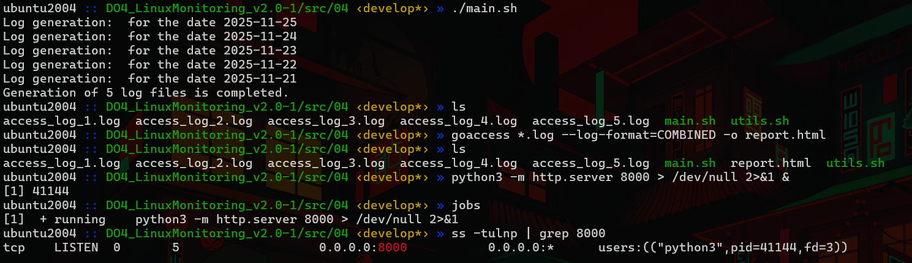
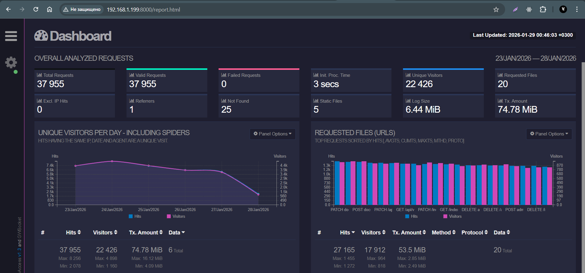

## Установка и использование сервиса goaccess:
- Установка: `sudo apt install goaccess`.

- Формирование **html-репорта**: `goaccess *.log --log-format=COMBINED -o report.html`

- `python3 -m http.server 8000 > /dev/null 2>&1 &` - запуск **HTTP-сервера** на **Python 3** в фоновом режиме на `8000` порту.

> Открытие страницы **goaccess** по адресу `IPVM:8000/report.html` :
>
> 
>

- Просмотр логов в терминале (в реальном времени): `goaccess *.log --log-format=COMBINED`.

- `goaccess *.log --log-format=COMBINED -o report.html --real-time-html`. Флаг `--real-time-html` обеспечивает обновление данных.

Утилита Socket Statistics

## Проверка состояния сетевых соединений

- `ss -at dst IP_HOST`

*Показывает все **TCP-соединения** `(-t)`, включая активные и ожидающие (слушающие) порты `(-a)`, где адресом назначения `(dst)` является `IP_HOST`.
Полезно, чтобы увидеть, какие связи установлены с конкретным хостом.*

- `ss -t4 state time-wait` - Выводит список только **IPv4** `(-4)` **TCP-соединений** `(-t)`, которые находятся в состоянии **TIME-WAIT**.

*Состояние **TIME-WAIT** возникает, когда соединение уже закрыто, но система удерживает запись о нем некоторое время, чтобы убедиться, 
что запоздавшие пакеты не создадут проблем. Большое количество таких строк может указывать на частые короткие подключения.*

