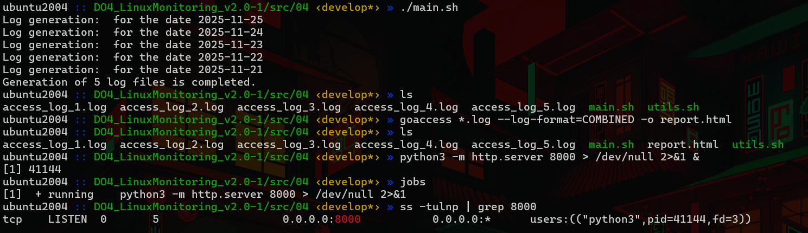
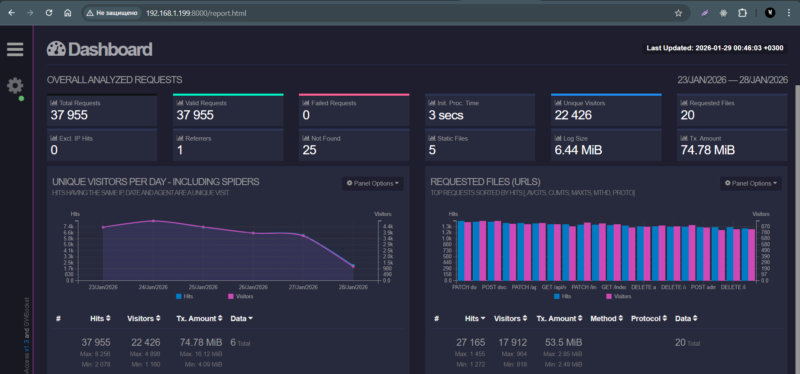

## Установка и использование сервиса goaccess:
- Установка: `sudo apt install goaccess`.

- Формирование **html-репорта**: `goaccess *.log --log-format=COMBINED -o report.html`

- `python3 -m http.server 8000 > /dev/null 2>&1 &` - запуск **HTTP-сервера** на **Python 3** в фоновом режиме на `8000` порту.

> Открытие страницы **goaccess** по адресу `IPVM:8000/report.html` :
>
> 
>

- Просмотр логов в терминале (в реальном времени): `goaccess *.log --log-format=COMBINED`.

- `goaccess *.log --log-format=COMBINED -o report.html --real-time-html`. Флаг `--real-time-html` обеспечивает обновление данных.