**Prometheus** и **Node Exporter** работают в связке по принципу **«сборщик»** и **«поставщик данных»**.

**Prometheus** — база данных временных рядов, которая опрашивает цели.
**Node Exporter** - собирает метрики ресурсов **(CPU, RAM, диск)** с сервера, без которых **Prometheus** не покажет данных.

**Актуальные версии prometheus и node_exporter:** https://prometheus.io/download/

## Установка и запуск сервисов node_exporter и prometheus:

```` bash
mkdir -p ~/monitoring_tools
cd ~/monitoring_tools # создаем и переходим в директорию для утилит

wget https://github.com/prometheus/node_exporter/releases/download/v1.8.1/node_exporter-1.8.1.linux-amd64.tar.gz # скачиваем node_exporter v.1.8.1

tar xvfz node_exporter-*.linux-amd64.tar.gz # разархивируем node_exporter

cd node_exporter-*.linux-amd64/

./node_exporter > /dev/null 2>&1 & # запуск node_exporter с освобождением терминала
````

```` bash
cd ~/monitoring_tools # переходим в директорию для утилит
wget https://github.com/prometheus/prometheus/releases/download/v3.9.1/prometheus-3.9.1.linux-amd64.tar.gz # скачиваем prometheus v.3.9.1

tar xvfz prometheus-*.linux-amd64.tar.gz # разархивируем prometheus

cd prometheus-3.8.0-rc.1.linux-amd64/
````

- Настраиваем конфигурационный файл **Prometheus** на сбор метрик с **node_exporter** :

> Конфигурационный файл `prometheus.yml` :
>
> 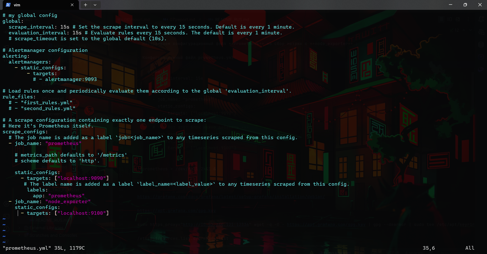
>

```` yaml
# ... остальной файл

    static_configs:
      - targets: ["localhost:9090"]
       # The label name is added as a label `label_name=<label_value>` to any timeseries scraped from this config.
        labels:
          app: "prometheus"
          
  # --- Добавленный блок ---
  - job_name: "node_exporter"
    static_configs:
      - targets: ["localhost:9100"]
````

 - Запуск **prometheus** с освобождением терминала `./prometheus > /dev/null 2>&1 &`

> Успешный запуск **node_exporter** на порту `9100` и **prometheus** на `9090` :
>
> 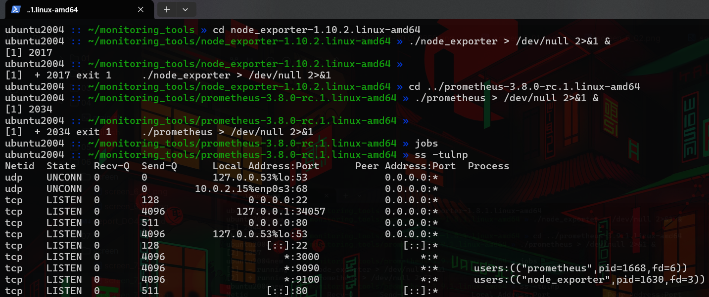
>

> Проверяем активные состояния **prometheus** и **node_exporter** по адресу `IPVM:9090/targets` :
>
> 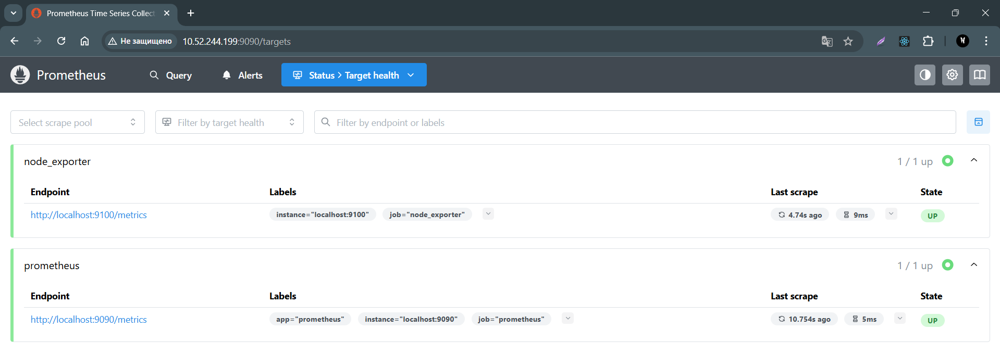
>

---

## Установка, запуск и настройка сервиса grafana:

**Актуальные версии grafana и инструкция по установке:** 

https://grafana.com/docs/grafana/latest/setup-grafana/installation/debian/

<style>
  details {
    border: 1px solid #ccc;
    border-radius: 8px;
    padding: 10px;
    transition: all 0.3s ease;
    margin-bottom: 10px;
    font-family: sans-serif;
  }

  summary {
    font-weight: bold;
    cursor: pointer; /* Показывает, что кликабельно */
    list-style: none; /* Убирает стандартный треугольник */
    display: flex;
    justify-content: space-between;
    align-items: center;
  }

  summary::-webkit-details-marker {
    display: none;
  }

  summary::after {
    content: '+';
    font-size: 1.2rem;
    font-weight: bold;
  }

  details[open] summary::after {
    content: '−';
  }

  details[open] summary {
    margin-bottom: 10px;
    color: #007bff;
  }
</style>

<details>
  <summary>Установка grafana через прокси vpn хоста. Нажмите, чтобы развернуть...</summary>
  <p>

  - На хосте необходимо включить **VPN** с функцией **"Allow Connection from LAN"**

  - Создаем конфигурационный файл пакетного менеджера APT `/etc/apt/apt.conf.d/80proxy`, указывающий использовать прокси-сервер для загрузки обновлений и пакетов.

  - В файл `/etc/apt/apt.conf.d/80proxy` задаем настройки индивидуального прокси исключительно для репозитория Grafana, не затрагивая остальные источники:

  ```
  Acquire::https::Proxy::apt.grafana.com "http://IP_HOST:PORT_VPN/";
  
  # Пример ip хоста и порт vpn
  # Acquire::https::Proxy::apt.grafana.com "http://10.52.244.121:12334/";

  ```

  - Установка необходимых пакетов **grafana**: 

  ```` bash
  sudo apt-get install -y apt-transport-https wget
  ````

  - Создание директории для **GPG-ключа**

  ```` bash
  sudo mkdir -p /etc/apt/keyrings/
  ````

  - Скачивание и добавление **GPG-ключа**, с параметром `https_proxy="http://IP_HOST:PORT_VPN"`

  ```` bash
  sudo https_proxy="http://10.52.244.121:12334" wget -q -O - https://apt.grafana.com/gpg.key | gpg --dearmor | sudo tee /etc/apt/keyrings/grafana.gpg > /dev/null
  # 10.52.244.121:12334 - пример ip хоста и порт vpn
  ````

  - Добавление репозитория для стабильных main релизов:

  ```` bash
  echo "deb [signed-by=/etc/apt/keyrings/grafana.gpg] https://apt.grafana.com stable main" | sudo tee -a /etc/apt/sources.list.d/grafana.list
  ````

  - Добавление репозитория для beta main релизов:

  ```` bash
  echo "deb [signed-by=/etc/apt/keyrings/grafana.gpg] https://apt.grafana.com beta main" | sudo tee -a /etc/apt/sources.list.d/grafana.list
  ````

  > Проверяем файл конфигурации репозитория /etc/apt/sources.list.d/grafana.list:
  >
  > 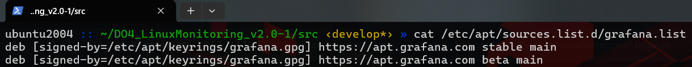
  >

  - Обновляем список доступных пакетов:

  ```` bash
  sudo apt-get update
  ````

  >
  > 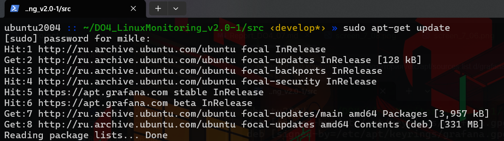
  >

  - Установка Grafana OSS:

  ```` bash
  sudo apt-get install grafana
  ````

  - Установка Grafana Enterprise: 

  ```` bash
  sudo apt-get install grafana-enterprise
  ````

  </p>
</details>

---

- Перезапуск демона **Grafana**:

```` bash
sudo systemctl daemon-reload
sudo systemctl enable grafana-server
sudo systemctl start grafana-server
````

- Проверка статуса сервиса **Grafana**:

```` bash
sudo systemctl status grafana-server
````

> status  **grafana-server**:
>
> 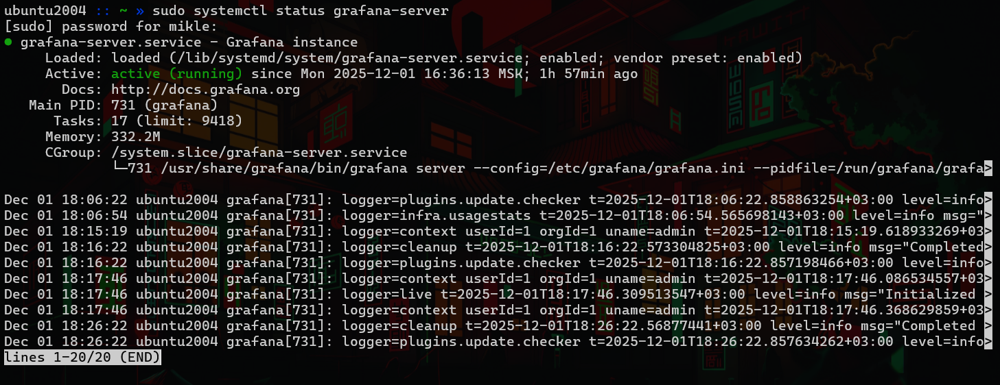
>

---

## Создание и настройка дашборда grafana:

1. **Зайти в интерфейс Grafana** по адресу `IPVM:3000` 
2. **Войти в лк** по `login/pass` *(по дефолту admin / admin)*.
3. Добавить новый источник данных **Prometheus** во вкладке `Connections`.

> Источник **Prometheus** по адресу `http://localhost:9090`:
>
> 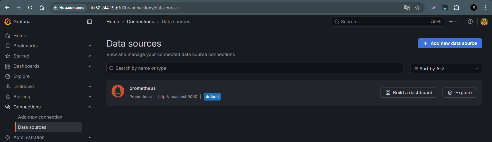
>

4. Перейти во вкладку `Dashboards`, затем `New` -> `New Dashboard`.
5. Добавление окон с метриками -> **`Add visualization`**.

- Добавляем выборки метрик с помощью [PromQL](https://timeweb.com/ru/blog/authors/mironov-styopa/articles/chto-takoe-promql-i-kak-s-nim-rabotat/).

#### **Панель 1: Загрузка ЦПУ**

1.  **Запрос:** Внизу, в редакторе запросов (`Query`), нажимаем кнопку **`Code`**. Вводим запрос в текстовом поле:

```promql
100 - (avg by (cpu) (rate(node_cpu_seconds_total{mode="idle"}[1m])) * 100)
```

`Run queries` - для отправки запроса и отображения метрик.

<details>
  <summary>Разбор PromQL запроса</summary>

  1. `node_cpu_seconds_total{mode="idle"}`: выбираем метрику времени, которое процессор провел в режиме бездействия (idle).
  2. `rate(...[1m])`: вычисляем среднюю скорость изменения метрики за последнюю 1 минуту. Доля времени бездействия (от 0 до 1).
  3. `avg by (cpu) (...)`: агрегируем данные, высчитывая среднее значение в разрезе каждого ядра (label cpu).
  4. `* 100`: переводим долю в проценты.
  5. `100 - ...`: вычитаем процент бездействия из 100%, чтобы получить процент занятости процессора. 
  **Итог:** Получаем список ядер с текущим процентом их загрузки (например, `{cpu="0"} 15.5, {cpu="1"} 20.2)`.

</details>

2.  **Настройки (справа):**
    *   `Panel options` -> `Title`: **Загрузка ЦПУ**
    *   `Standard options` -> `Unit`: **Percent (0-100)**
3.  **`Save dashboard`**.
4.  Называем дашборд **System Monitoring** и нажимаем **`Save`**.

---
#### **Панель 2: Доступная оперативная память**

1.  **`+` (Add panel)**, выбираем `Add visualization`.
2.  **Запрос:** В режиме `Code`:
    ```promql
    node_memory_MemAvailable_bytes
    ```

<details>
  <summary>Разбор PromQL запроса</summary>

- `node_memory_MemAvailable_bytes`: показывает объем оперативной памяти (в байтах), который доступен для запуска новых приложений без ухода в **swap**.
- **Swap** (своп/раздел подкачки) — специальное место на жестком диске, которое операционная система использует как «дополнительную оперативную память».

</details>

3.  **Настройки (справа):**
    *   `Panel options` -> `Title`: **Доступная память**
    *   `Standard options` -> `Unit`: **Data (IEC) -> bytes(IEC)**
4.  **`Save dashboard`**.

---
#### **Панель 3: Свободное место на диске**

1.  **`+` (Add panel)** -> `Add visualization`.
2.  **Запрос:** Режим `Code`. В поле вводим:
    ```promql
    node_filesystem_avail_bytes{mountpoint="/"}
    ```

<details>
  <summary>Разбор PromQL запроса</summary>

- `node_filesystem_avail_bytes{mountpoint="/"}`: показывает объем доступного свободного места на корневом разделе диска (в байтах).
- Эта метрика показывает только то место, которое разрешено занимать обычным процессам. Системный резерв, который Linux оставляет для системы и пользователя root (обычно 5%), в значение этой метрики не входит.

</details>

3.  **Настройки (справа):**
    *   `Panel options` -> `Title`: **Свободное место на диске (/)**
    *   `Standard options` -> `Unit`: **Data (IEC) -> bytes(IEC)**
4.   **`Save dashboard`**.

---
#### **Панель 4: Операции ввода/вывода (I/O)**

1.  **`+` (Add panel)** -> `Add visualization`.
2.  **Запросы (их будет два):**
    *   Режим `Code`. В поле для запроса **A**:
        ```promql
        rate(node_disk_reads_completed_total[1m])
        ```
    *   **`+ Add query`**. Запрос **B**:
        ```promql
        rate(node_disk_writes_completed_total[1m])
        ```
3.  **Настройки (справа):**
    *   `Panel options` -> `Title`: **Операции I/O на диске**
    *   `Standard options` -> `Unit`: **Throughput -> Operations/sec (ops)**
    *   В секции `Legend`. В поле `Values` выбираем `Last (not null)`.
4.  **`Save dashboard`** -> **`Save`**.

<details>
  <summary>Разбор PromQL запроса</summary>

- `rate(node_disk_reads_completed_total[1m])`: среднее количество операций чтения в секунду за последнюю минуту.
- `rate(node_disk_writes_completed_total[1m]`: среднее количество операций записи в секунду за последнюю минуту.
- Эти две метрики показывают интенсивность операций ввода-вывода (IOPS) для дисков.

</details>

## Визуализация метрик в интерфейсе **Grafana**

---

>  Готовый дашборд **Grafana** с отображением ЦПУ, доступной оперативной памятью, свободным местом и кол-во операций ввода/вывода на жестком диске:
>
> 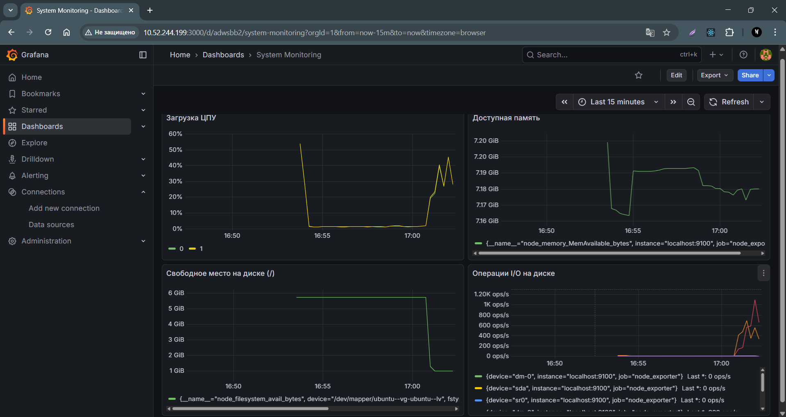
>

- Запустил [bash-скрипт](../02/main.sh) из [Части 2](../02).

>  Место на жестком диске:
>
> 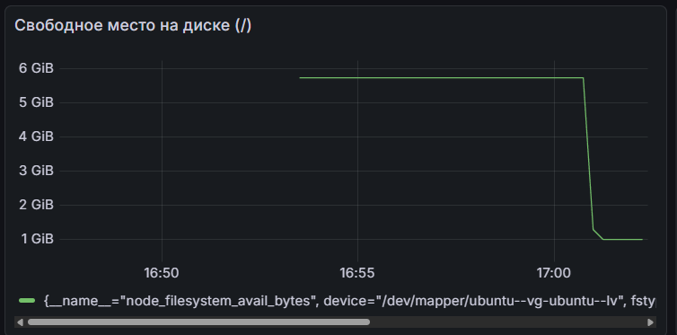
>

>  Операции чтения/записи:
>
> 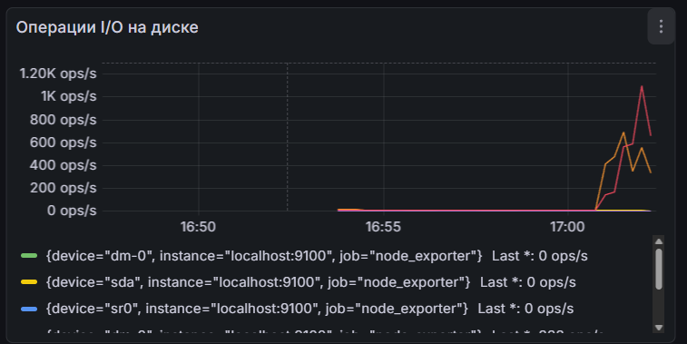
>

- Установил утилиту stress.
- Запустил команду `stress -c 2 -i 1 -m 1 --vm-bytes 32M -t 10s`.

<details>
  <summary>Разбор команды stress</summary>

- `-c 2` (CPU): запускается 2 рабочих потока, которые будут непрерывно вычислять квадратные корни, загружая 2 ядра процессора на 100%.
- `-i 1` (IO): запускается 1 поток, вызывающий функцию sync(), это заставляет систему сбрасывать данные из буферов на диск (создает нагрузку на ввод-вывод).
- `-m 1 --vm-bytes 32M` (Memory): : запускается 1 поток, который выделит 32 Мегабайта оперативной памяти и будет постоянно записывать/считывать их (имитация нагрузки на RAM).
- `-t 10s` (Time): данная команда запустится на 10 секунд.

</details>

>  Вывод команды `stress -c 2 -i 1 -m 1 --vm-bytes 32M -t 10s`:
>
> 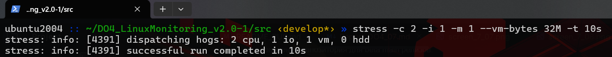
>

>  Нагрузка жесткого диска, оперативной памяти и ЦПУ:
>
> 
>