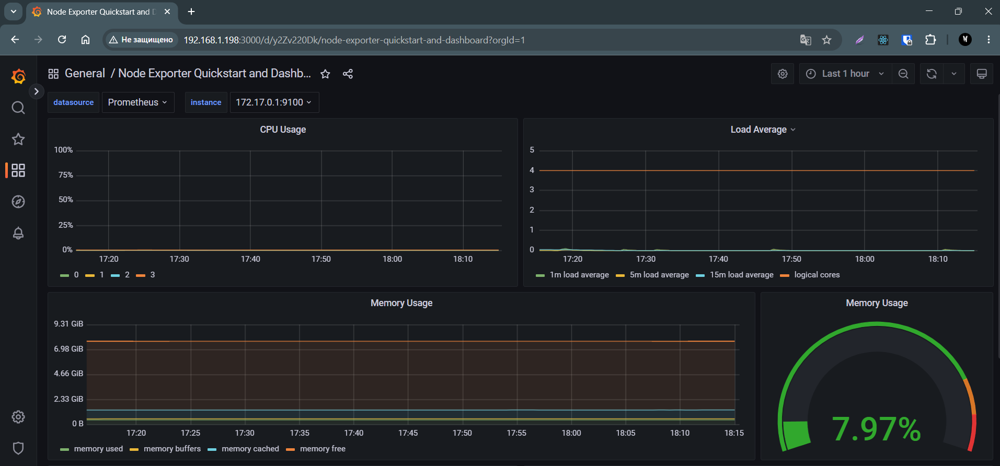
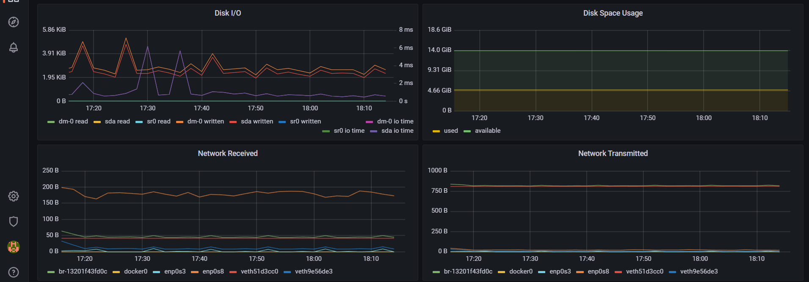
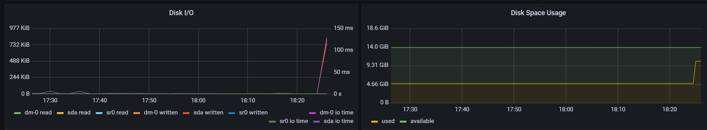
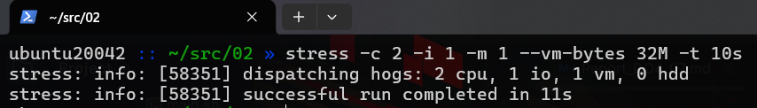
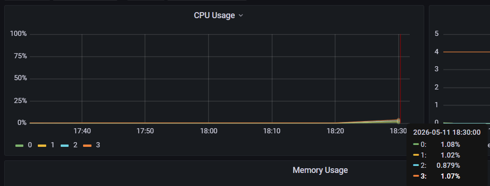
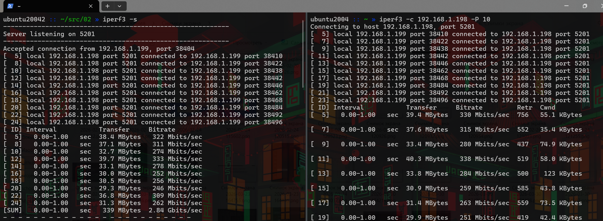
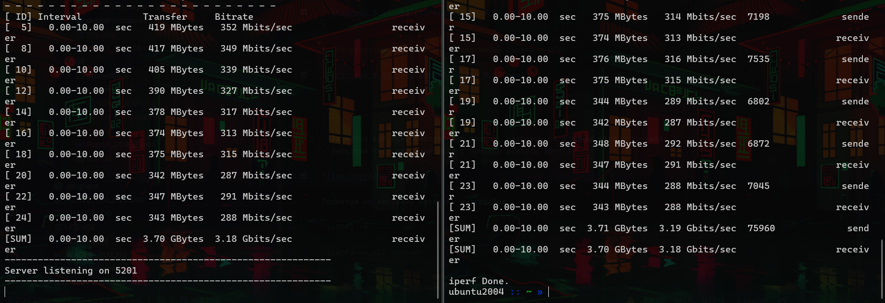
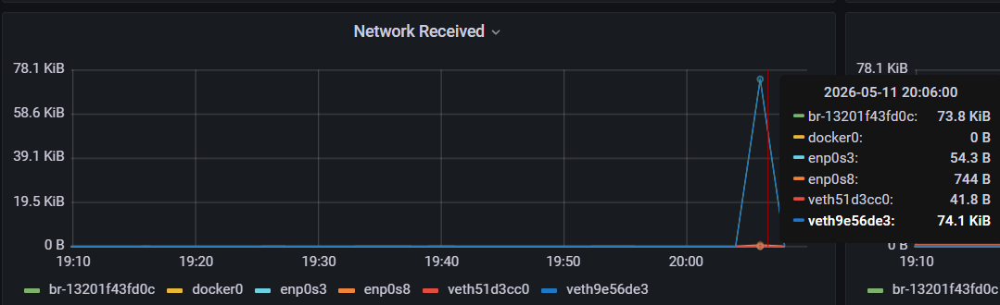
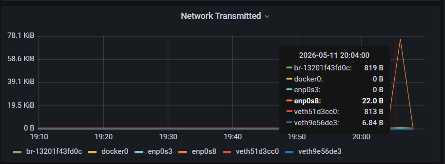

## Готовый Дашборд для мониторинга системы (Node Exporter Quickstart and Dashboard)

- Поднял 3 [контейнера](docker-compose.yml): **prometheus**, **grafana** и **node_exporter**.

- В конфигурации контейнера **node_exporter** указан параметр `network_mode: host`, чтобы **node_exporter** имел прямой доступ к сетевым интерфейсам хоста. (Для тестов с помощью `iperf3`)

---

- Актуальный **id**, **json-конфиг** и **инструкция по установке** дашборда: [официальная ссылка grafana](https://grafana.com/grafana/dashboards/13978-node-exporter-quickstart-and-dashboard/)

- Т.к. дашборд использует `job=node` селектор для запроса метрик, в файле конфигурации [prometheus.yml](prometheus/prometheus.yml) указал `- job_name: 'node'`.

- Так же указал targets: `['172.17.0.1:9100']` (IP хоста в сети докер и прокинутый порт node_exporter).

---

1. В интерфейсе **Grafana**, во вкладке **Connections** добавил новый источник данных из контейнера **Prometheus** - `http://prometheus:9090`.
2. **Dashboards** -> **Import**.
3. В поле `Import via grafana.com` указал **ID**: **13978**, так же можно загрузить готовый **json-конфиг**.

>  Готовый Дашборд **Node Exporter Quickstart and Dashboard**:
>
> 
>
> 
>

---

- Провел те же тесты, что и в [Части 7](../07/Report_DO4_07.md##Визуализация-метрик-в-интерфейсе-Grafana):

- Запустил [bash-скрипт](../02/main.sh) из [Части 2](../02).

>  Операции чтения/записи и место на жестком диске:
>
> 

>  Вывод команды `stress -c 2 -i 1 -m 1 --vm-bytes 32M -t 10s`:
>
> 
>

>  Нагрузка ЦПУ:
>
> 
>

---

- Запустил ещё одну виртуальную машину, находящуюся в одной сети с текущей.
- Запустил тест нагрузки сети с помощью утилиты iperf3:

>  Запустил на вм с grafana утилиту iperf3 в режиме сервера командой `iperf3 -s`:
>
> На второй вм запустил тест на пропускную способность в 10 потоков командой `iperf3 -c <IP машины> -P 10`.
> 
> 
>
> 
>

>  Нагрузка сетевого интерфейса:
>
> 
>
> 
>