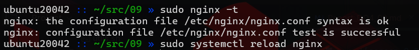
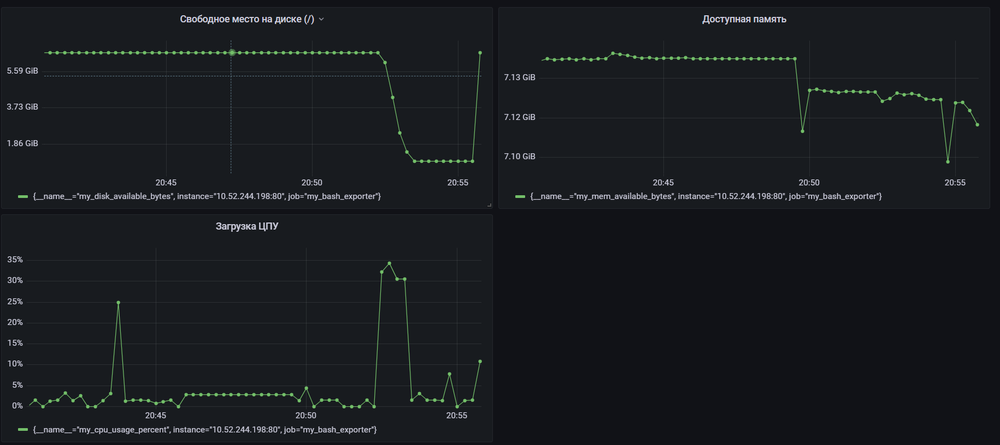

- Написал [bash-скрипт](main.sh), собирающие информацию метрики системы (ЦПУ, оперативная память, жесткий диск.

- Т.к. скрипт формирует **html** страничку и отдает в **nginx** по пути `/var/www/html`,
**Prometheus** получая выдаст ошибку парсинга. Явно указываем **Nginx**, что файл `metrics.html` - это обычный текст.

>  Указываем в `/etc/nginx/sites-available/default` отдавать `metrics.html` в формате **Plain Text**:
>
> 
>

```nginx
# ... остальной файл

server {
    listen 80 default_server;
    root /var/www/html;
    # ... остальные настройки ...

    # --- Добавленный блок ---
    location /metrics {
        alias /var/www/html/metrics.html;
        default_type text/plain;
    }
}
```

>  Проверил конфиг и перезагрузил Nginx командами `sudo nginx -t` и `sudo systemctl reload nginx`:
>
> 
>

---

- Поднял 2 [контейнера](docker-compose.yml): **prometheus** и **grafana**.

- В **grafana** добавил новый источник данных из контейнера **Prometheus** - `http://prometheus:9090`.

---


<details>
  <summary> Создал и настроил дашборд **grafana**, добавив выборки метрик:</summary>

#### Title: Загрузка ЦПУ

- **Query (запрос)**:

```promql
my_cpu_usage_percent
```
- **Unit (единицы измерения)**: Misc / Percent (0-100)


#### Title: Доступная память

- **Query (запрос)**:

```promql
my_mem_available_bytes
```
- **Unit (единицы измерения)**: Data / bytes(IEC) (это покажет MiB/GiB вместо MB/GB)

#### Title: Свободное место на диске (/)

- **Query (запрос)**:

```promql
my_disk_available_bytes
```
- **Unit (единицы измерения)**: Data / bytes(IEC)

</details>

>  Визуализация метрик в интерфейсе **Grafana**:
>
> 
>