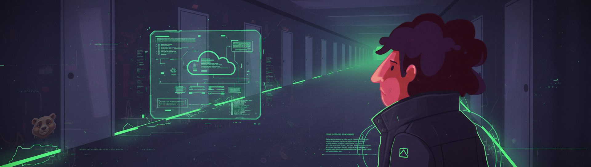

# Проект CI/CD для сборки и деплоя проекта C2_SimpleBashUtils

*The project was written from task S21.* 

Он посвящен настройке процессов непрерывной интеграции (CI) и непрерывного деплоя (CD) для автоматической сборки, тестирования и развертывания приложений. Проект включает написание пайплайнов для сборки, кодстайла, интеграционных тестов и деплоя на удаленный сервер.

## Содержание

1. [Настройка GitLab Runner](#1-настройка-gitlab-runner)
2. [Этап сборки](#2-этап-сборки)
3. [Тест кодстайла](#3-тест-кодстайла)
4. [Интеграционные тесты](#4-интеграционные-тесты)
5. [Этап деплоя](#5-этап-деплоя)
6. [Уведомления через Telegram](#6-уведомления-через-telegram)

---

## 1. Настройка GitLab Runner

На первом этапе проекта была произведена установка и настройка **GitLab Runner** на виртуальной машине с **Ubuntu Server 22.04 LTS**.

- Установка **gitlab-runner** с использованием официальной документации.
- Регистрация **GitLab Runner** для проекта `DO_CICD`, что позволяет запускать пайплайны.

[Подробнее о настройке GitLab Runner](src/Report_DO6.md#1-настройка-gitlab-runner)

---

## 2. Этап сборки

Для сборки приложений был написан этап **CI**, который использует **Makefile** из проекта **C2_SimpleBashUtils**.

- В файле `.gitlab-ci.yml` был добавлен этап, который собирает проект.
- Артефакты сборки (исполняемые файлы) сохраняются в директорию с хранением на 30 дней.

[Подробнее об этапе сборки](src/Report_DO6.md#2-сборка)

---

## 3. Тест кодстайла

На этом этапе был реализован тест кодстайла с использованием утилиты `clang-format`.

- В **CI** был добавлен этап проверки кодстайла.
- Если кодстайл не проходит, пайплайн завершается с ошибкой и отображает вывод `clang-format`.

[Подробнее о тестировании кодстайла](src/Report_DO6.md#3-тест-кодстайла)

---

## 4. Интеграционные тесты

Был создан этап для интеграционного тестирования.

- Интеграционные тесты запускаются автоматически только при успешной сборке и прохождении кодстайла.
- В случае ошибки тестирования, пайплайн также завершится с ошибкой.

[Подробнее об интеграционных тестах](src/Report_DO6.md#4-интеграционные-тесты)

---

## 5. Этап деплоя

После успешного прохождения всех тестов, исполняемые файлы автоматически переносятся на другую виртуальную машину.

- Поднята вторая виртуальная машина с **Ubuntu Server 22.04 LTS**.
- Написан скрипт на **bash** для копирования артефактов на удаленный сервер с использованием `ssh` и `scp`.
- Этап деплоя запускается вручную и разворачивает проект на сервере.

[Подробнее об этапе деплоя](src/Report_DO6.md#5-этап-деплоя)

---

## 6. Уведомления через Telegram

Был настроен бот в **Telegram** для отправки уведомлений об успешности прохождения всех этапов пайплайна.

- Уведомления отправляются при успешном завершении как **CI**, так и **CD**.
- Сообщения содержат статус этапов и могут быть настроены в произвольном виде.

[Подробнее о настройке уведомлений](src/Report_DO6.md#6-уведомления)

---

## Заключение

Проект предоставил возможность углубленного изучения основ **CI/CD**, включая настройку **GitLab Runner**, написание этапов для сборки, тестирования и деплоя. Были приобретены навыки работы с виртуальными машинами, `bash`-скриптами, а также автоматизации процессов развертывания.

